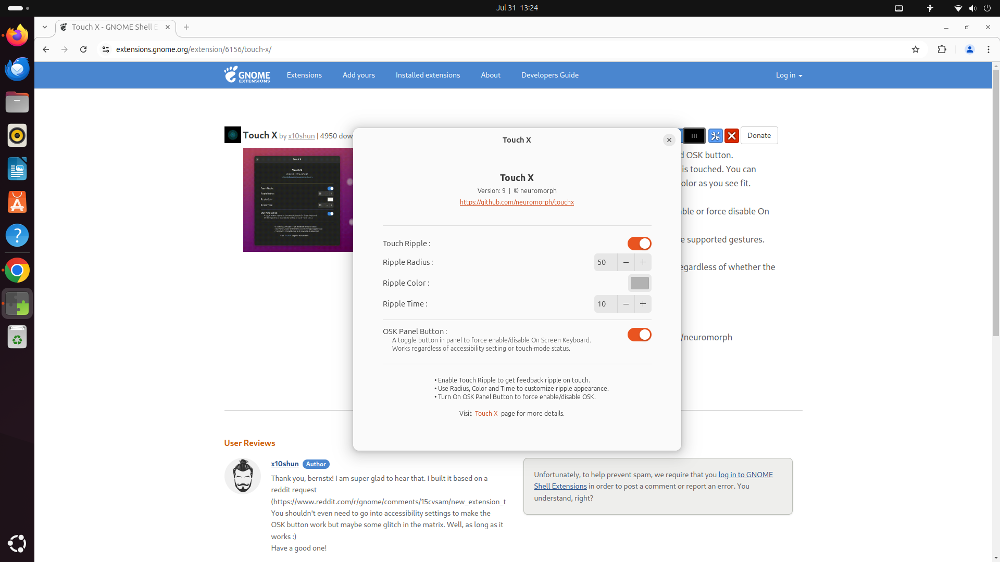

# Optimizing Touchscreen HMIs for Industrial Workloads
In the industrial space, touchscreen HMIs (Human Machine Interfaces) are very popular. Allowing operators to interact with computerized systems without the need for a keyboard and mouse. This reduces space needs and allows systems to be directly mounted to electrical enclosures & kiosks. However, application development, design, and integration differs from traditional desktop use-cases. This application note will explain how to develop, design, and optimize the user experience with touchscreen HMIs across Windows and Linux distributions.

If you’d like to know more about selecting the right type touchscreen for your application, look at reading our blog post, [7 Step Process to Selecting an Industrial Panel PCs](https://www.onlogic.com/blog/the-7-things-to-consider-before-buying-industrial-panel-pc). This application note assumes you are already familiar with the differences between capacitive and resistive screens.

## Basic Touch Functionality & OS Specific Considerations
Modern operating systems are equipped to handle touch inputs out of the box. When it comes to basic touch functionality both Windows and Linux operate in a similar manner. For this application note Windows 11 Pro, Ubuntu 22.04, and Ubuntu 24.04 were tested for functionality.

- A single press of the screen will act as a left mouse button click
- Holding down a finger to the screen will act as the right mouse button click.
- Multi-touch gestures depend on the operating system and will only be consistent with capacitive screens.

### Legacy Windows stylus applications:
As touchscreens have been around for a long time, some users need functionality consistent for their legacy applications to work properly, particularly those based on Windows Vista that utilize a resistive stylus. Some of these applications operated based on a “click” actuation once a pen was removed from the screen. In order to replicate this functionality with a modern touchscreen we will need to use an utility to emulate it. [EETI’s eGalaxTouch Windows utility](https://www.eeti.com/drivers_Win.html) has been tested by OnLogic for use with Tacton’s resistive for those users that need to emulate legacy applications.

### Right Click on Linux GNOME Desktop:
While holding down a touch will pull up the right click menu, this does not work on files on the GNOME desktop environment. In all other cases such as taskbar and in application it will work correctly. This can sometimes be addressed by enabling Click Assist in the Accessibility settings to simulate a secondary click, however this did not work consistently across all distributions and screen types. However, as we will discuss further on, it is best to not utilize right click when possible for ease of use.

## On-Screen Keyboard (OSK) & OS Specific Considerations
When we need to take inputs from users that would otherwise use a keyboard, we can utilize an OSK to create a virtual keyboard that our users can press using the touchscreen. When enabled they will show up when clicking into a text or numerical entry box. Both Windows and Linux distros offer a default OSK, but may require some setup depending on your application.

### Windows - OSK vs. Touch Keyboard:

Somewhat confusingly, Windows offers both a standard OSK and a touch keyboard. Both options pop out as a window when needed, but the touch keyboard (shown above) offers much more flexibility and responsiveness in terms of customizing size and position. It is best to use the touch keyboard option when possible. Additionally, with Windows 11, an icon can be added to the taskbar to allow for the keyboard to be turned on and off manually if desired. To use properly, ensure the standard OSK is turned off in the keyboard section of the Accessibility Menu & touch keyboard is turned on (Time & Language > Typing) and added to the taskbar (Personalization > Taskbar).

### Linux OSK & Implementation
The OSK can be enabled in the accessibility system menu under the typing section. It will pop-up from the bottom of the screen occupying about ⅓ of the screen space and can be manually brought up by swiping from the bottom of the screen (PCAP Only). This can present challenges as input boxes can become blocked by the OSK window.

Customization can be tricky, depending on your distro. Most modern distros (18.04+) use Wayland as a replacement for X11 window system protocol. Which means that older tools that utilize x11 will not work with modern distributions when trying to deploy system-wide. We need to consider how we will take inputs if we can not use the default OSK.

- Direct Application Integration:
    - Consider implementing the OSK directly into our application using compatible components or tools. For example, with Inductive Automation’s Perspective SCADA visualization tool, there are already pre-built keyboard and numpad components available for integration natively into projects. If developing an application from the ground-up, consider what your UI toolkit offers, such as QT6’s virtual keyboard.

- GNOME Extensions:
    - If we want to integrate outside of individual applications, there are other tools available through GNOME Extensions such as TouchX which adds a dedicated OSK button to the top taskbar, or GSJOSK, which offers a pop-out OSK however your mileage may vary as GSJOSK and other non-standard OSKs. In our testing, it did not work in full screen for browser sessions. OSK dependencies can vary greatly, so direct application integration is preferable.

## Wake-on-Touch
When a system is panel mounted a problem that becomes apparent is how to wake the system from standby/suspend state. While Windows 11 supports “Touch on Wake” natively, we don’t have the same option for the default Ubuntu 22.04/24.04 environment or within Windows 10. One obvious solution is to disable sleep/suspend in the power settings of your operating systems, however the Tacton platform offers some alternative hardware features that can help irregardless of a Windows or Linux environment.
- Infrared Proximity Wake - allows the embedded IR sensor to wake the system from sleep based on user proximity. The distance is enabled and customized via the LPMCU CLI tool.
- Remote Power Switch - A physical power button can be cabled out from the integrated DIO (Pin 1-2). A simple momentary switch will allow you to wake the computer.

## Application Best Practices
Based on the touch interactions we reviewed above, applications for touchscreens need to be built in a manner that allows users to easily interact with on-screen resources. This means that not all functions that worked on a desktop as a physical button are best used for touchscreen HMIs. We should follow similar best practices to mobile application design in terms of simplicity, ease of use, and consistency. This guide is not designed to be a complete overview of HMI design best practices, but please consider the following concepts specific to touch interactions.

### Touch Events
- Stick to single touch (i.e. left click) for use where possible. This will provide the most consistent experience. Since our fleet of devices may be heterogeneous, building applications that work well for all types of screens is ideal.
- Minimize components that require movement such as swiping, sliders, etc.
- **Do not use a touchscreen for momentary i.e. “jog” buttons for communicating with a PLC**. These are not consistent and cause a value to get “stuck” in a state. Consider using timers, automating actions, or keeping these as physical buttons next to the panel.
- Space buttons and size appropriately to make them easy to interact with.
### OSK
- Using an OSK with a resistive screen is time consuming and should be avoided when possible.
- Typing repeatedly on a touchscreen is time consuming. Barcodes, ID scanners, RF devices, and other input devices will automate data collection.
### Gestures
- Gestures can be helpful, but should not be relied upon. Build straightforward navigation with buttons that allow easy navigation. The exception being applications that need to zoom, such as integration with Google Maps or OpenStreetMaps can benefit greatly from gesture support.
### Other
- Utilizing “Kiosk Mode” or auto-launch applications in full-screen during boot. This will minimize operator confusion and limit access to unapproved applications. IT best practices for locking down workstations should also be implemented.

